# __Práctica 1 - Tareas iniciales__

En este tutorial se describirá los pasos necesarios  para configurar:

+  Github
+ Nodejs
  - Express
+ Foto de perfil
+ Atom
+ Cloud9
+ Markdown
+ Traductores Markdown -> HTML
 - Pandoc
 - Kramdown

# 1. [Github](https://github.com/)

### 1.1. Introducción a los conceptos
Para empezar necesita tener cuenta en [Github](https://github.com/), así que si no la tiene, créela.

En este apartado se definirán varias funcionalidades y conceptos de Github, como:
+ Github Classrom
+ Repository
+ Fork
+ Commit
+ Push/Sync
+ Pull request
+ Github Pages
+ Issues

__Si usted conoce estas funcionalidades puede saltarse la introducción (1.1).__

###### 1.1.1. [Github Classroom](https://education.github.com/guide)

Una clase (classroom) en Github es una [organización](https://help.github.com/articles/what-s-the-difference-between-user-and-organization-accounts/) en la cual se pueden asignar programas de estudio  a los alumnos y éstos pueden crear __Issues__ para clarificar cuestiones. Además, si el respositorio es público, otros profesores podrán colaborar con usted para mejorar la calidad de sus materias. En el apartado __1.2__ se explica el caso concreto de esta primera práctica.

###### 1.1.2. Repository

Un repositorio es el elemento más básico de GitHub. Es prácticamente un directorio de un proyecto. Un repositorio contiene todos los ficheros de un proyecto (incluyendo la documentación), y almacena todo el historial de cambios de cada uno. Los repositorios pueden tener varios colaboradores y pueden ser públicos o privados.

###### 1.1.3. [Fork](https://guides.github.com/activities/forking/)

Crear una bifurcación (fork) es producir una copia personal del proyecto de otro. Forks actúa como una especie de puente entre el repositorio original y su copia personal. Puedes además enviar un __Pull Requests__ para ayudar a otras personas a realizar mejores proyectos aportando tus mejoras al proyecto original. __Forking es la base de la codificación social en GitHub.__

###### 1.1.4. [Commit](https://git-scm.com/docs/git-commit)

`git commit` es el comando que permite guardar los cambios de un repositorio local para posteriormente mandarlos a un repositorio remoto con un __Push__.

###### 1.1.5. Push

Cuando tu proyecto está en un punto en el que deseas compartirlo, tienes que pushearlo con el comando `git push`. Este comando solo funciona si el proyecto ha sido clonado desde un servidor en el que tienes acceso y si nadie ha pusheado mientras tanto.

###### 1.1.6. Pull Requests

Un pull request es una petición que el propietario de un fork de un repositorio hace al propietario del repositorio original para que este último incorpore los commits que están en el fork.

###### 1.1.7. Github Pages

Una Github Page es una página web pública hosteada y publicada a través de Github. De modo que nuestro perfil de usuario o un respositorio puede tener asociada una.

###### 1.1.8. Issues

Las Issues son buenas para tener un seguimiento de las tareas, mejoras y bugs de nuestros proyectos. Son como una especie de email excepto que son compartidas por todo el equipo del proyecto.

### 1.2. Classroom ULL-ESIT-GRADOII-PL

Como hemos visto anteriormente una clase es una organización con asignaciones, por lo tanto vamos a solicitar la creación de nuestro resitorio el la clase.

###### 1.2.1 Creación de repositorio

Para ello debemos entrar en el link que se muestra a continuación:

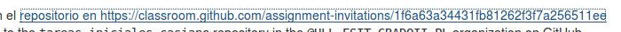

Entramos y se nos mostrará una propuesta para aceptar el acceso a un repositorio que se creará llamado *tareas-iniciales-nombreUsuario* que justamente es el nombre usuario con el que estamos logeados que en mi caso es alu0100824780:

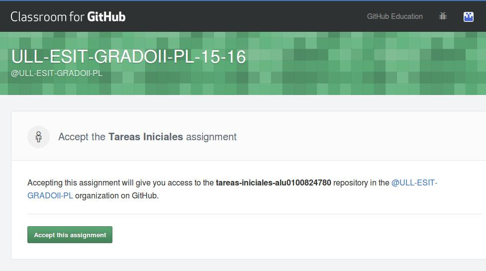

Le damos a __Accept this assignment__ y esperamos a que nos manden una confirmación al email.

Cuando nos manden el email se habrá creado un repositorio en la cuenta del profesor como se muestra a continuación:

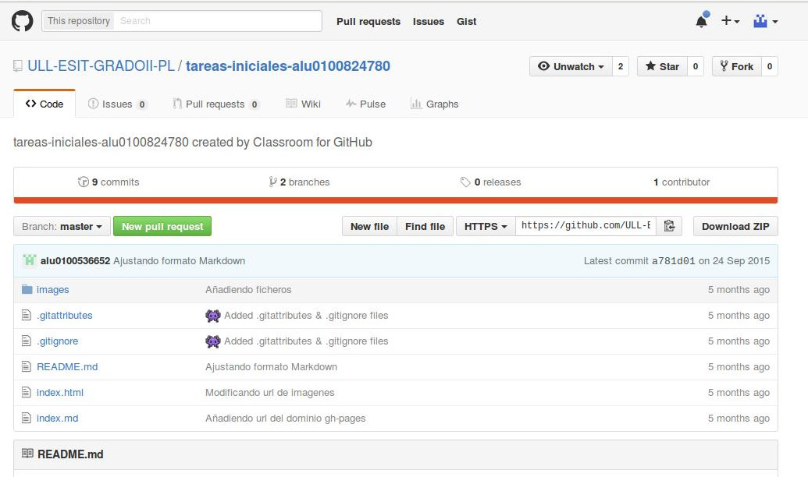

###### 1.2.2. Fork del repositorio

Muy bien, ahora ya tenemos nuestro "espacio" en la clase por lo tanto ahora tenemos que hacer un __fork__ para tener una copia del respositorio en nuestra cuenta. Para ello simplemente clickeamos en el botón *Fork*:

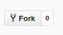

Ahora simplemente esperamos y nos redirigirá a la copia creada en nuestra cuenta:

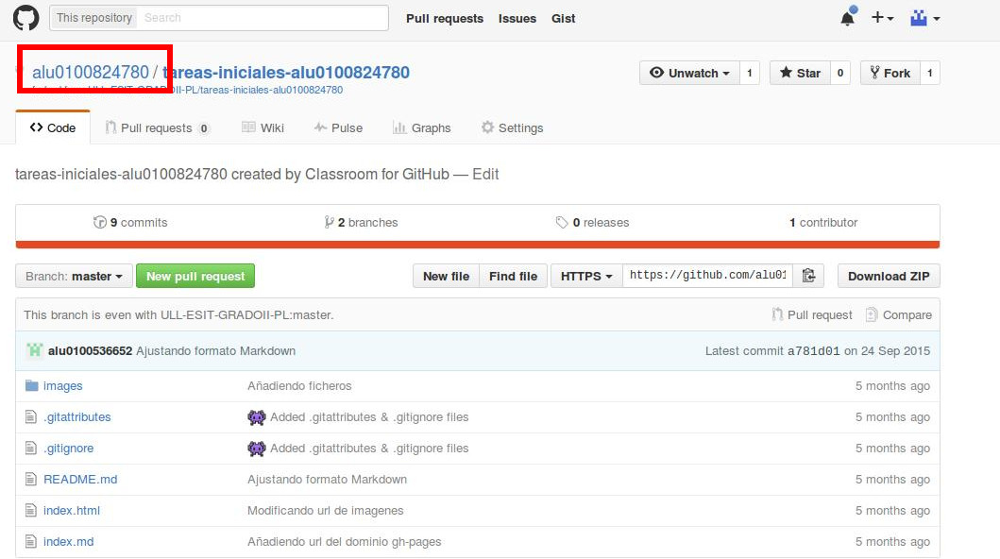

Además, podemos fijarnos que nos indica dónde se encuentra el repositorio original:

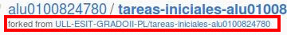

###### 1.2.3. Clonación del repositorio

Ahora es hora de clonar el respositorio en nuestro ordenador para poder trabajar en él. Para ello simplemente cogemos el link SSH o HTTPS, vamos a nuestra terminal y,  colocados en el directorio en donde queremos crear el repositorio ejecutamos el comando:

`git clone git@github.com:usuario/tareas-iniciales-usuario.git`

Donde claramente usuario es vuestro nombre de usuario.

###### 1.2.4. Modificación y pusheado

Ahora modificamos los ficheros que queramos, guardamos con `git add . && git commit -m "First Commit"` y los subimos con `git push`.

###### 1.2.5. Pull request

Ahora nos gustaría que los cambios que hemos realizado en nuestra copia del repositorio se actualizaran en el repositorio original y para ello usaremos el __Pull Request__.

Debemos ir a la copia del repositorio en nuestra  cuenta y pulsar el botón que se muestra a continuación:

Este botón nos llevará a una página en la cual podemos ver los cambios respecto a la versión original:

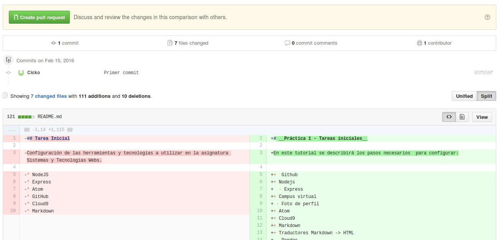

Finalmente pulsando en el botón __Create pull request__ nos permitirá opcionalmente asociarle un comentario para justificarle al dueño del repositorio original nuestra petición de actualización y ya solo tenemos que esperar a que la acepte.

# 2. [Nodejs](https://nodejs.org)

Node.js es un intérprete Javascript que trabaja un entorno en tiempo de ejecución multiplataforma, de código abierto, para la capa del servidor  basado en una arquitectura orientada a eventos y basado en el motor V8 de Google. Fue creado con el enfoque de ser útil en la creación de programas de red altamente escalables, como por ejemplo, servidores web.

### 1.2. Instalación

La instalación la realizaré en el sístema operativo Linux. Para ello primero ejecutamos el siguiente comando:

`curl -sL https://deb.nodesource.com/setup_4.x | sudo -E bash -`

Este comando lo que hace es descargar los ficheros necesarios para la instalación posterior con el comando:

`sudo apt-get install -y nodejs`

### 1.3. Comprobación

Ahora debemos comprobar que funciona el npm *(node package manager)*, para ello simplemente ejecutamos el siguiente comando:

`npm`

Esto lo que debería mostrarnos es una descripción del comando:

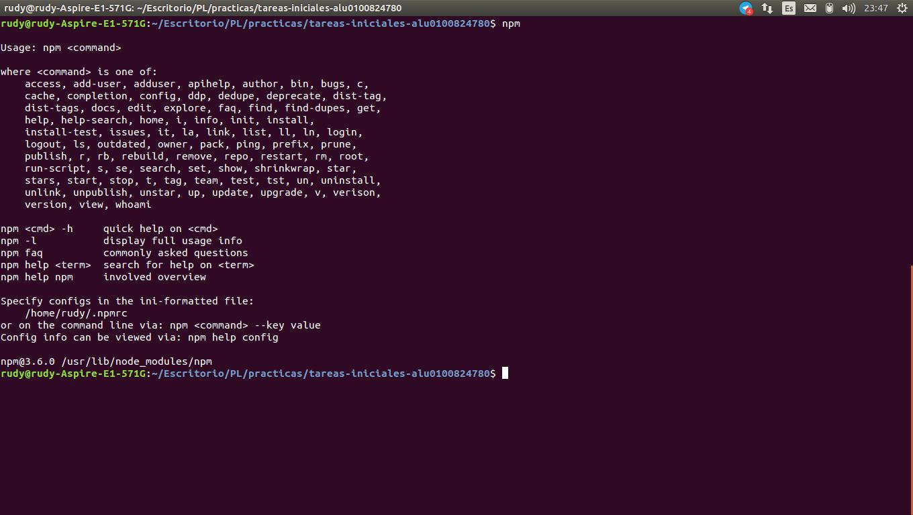

Si nos sale esto entonces podemos confirmar que tenemos el npm correctamente instalado.

Además podemos ahora comprobar que funciona el intérprete ejecutando:

`node`

Con este comando debería salirnos el intérprete REPL de Javascript incorporado en Nodejs:

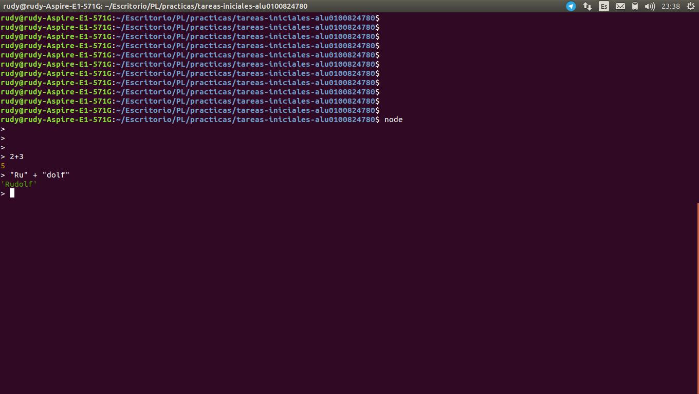

### 1.4. Instalación de express

Para instalar express globalmente simplemente ejecutamos el comando:

`npm install -g express`

# 3. Foto de perfil

Para establecer nuestra foto de perfil en el campusvirtual simplemente debemos dirigirnos hacia donde está nuestro nombre y pulsar en editar perfil como se muestra a continuación:

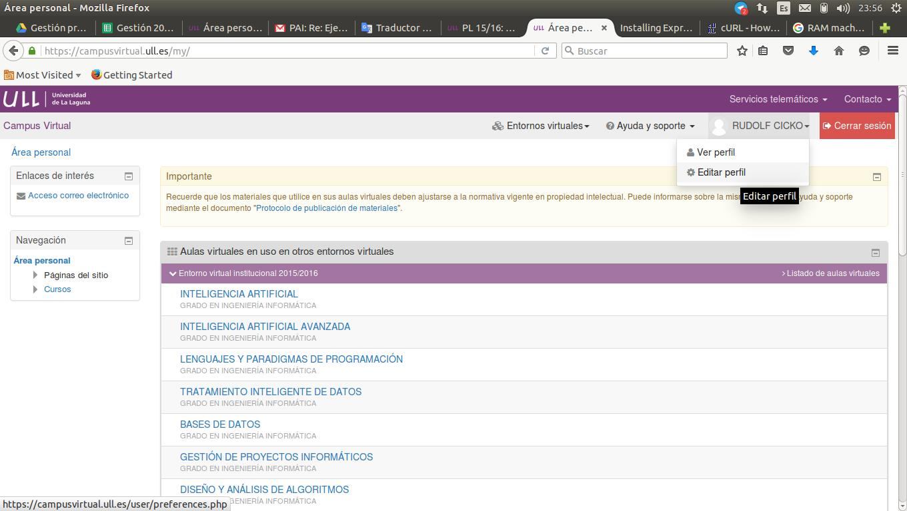

Entramos ahora en Editar perfil de nuevo

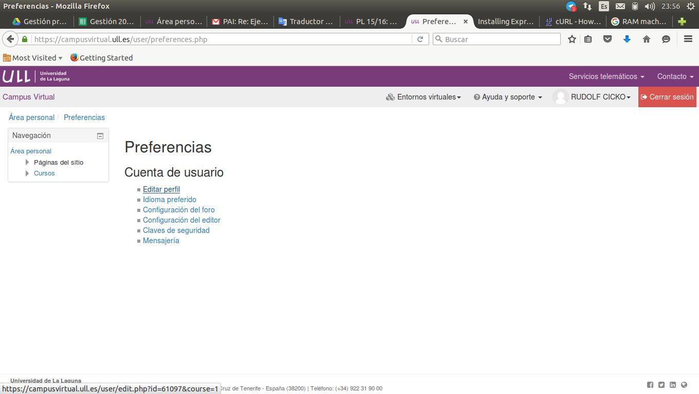

Y finalmente bajamos hasta llegar a la sección de __Imagen del usuario__, en donde podemos seleccionar la imagen deseada cómodamente gracias al gestor de archivos.

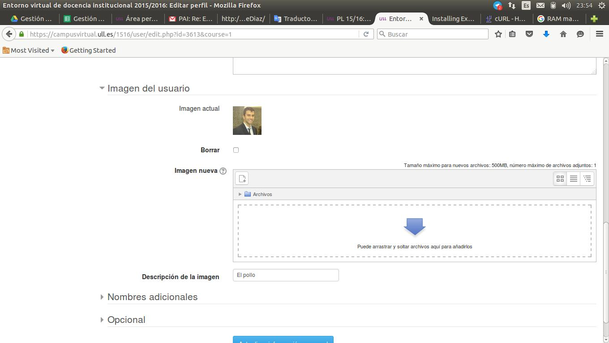

# 4. [Atom](https://atom.io)

Atom es un Editor de código fuente de código abierto y libre para Linux, Windows y OS X. Soporta plugins escritos en Node.js e integra control de versiones. Atom fue desarrollado por GitHub.

### 4.1. Instalación

Para instalar entramos en la página de [Atom](https://atom.io) y una vez dentro:

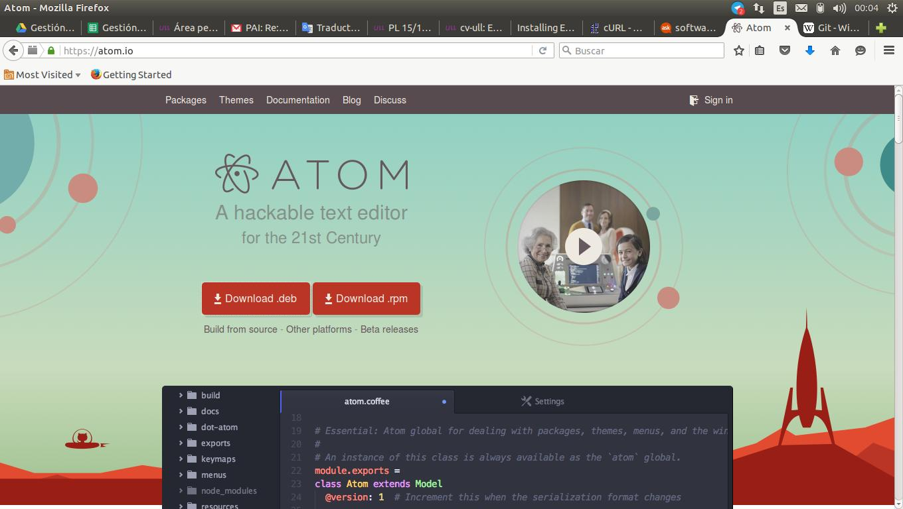

Instalas el paquete que más te guste. Yo en este tutorial descargaré el paquete .deb (debian).

Una vez descargado, ejecutamos el comando:

`sudo dpkg -i DEB_PACKAGE`

Finalmente para abrirlo ejecutamos en la terminal:

`atom`

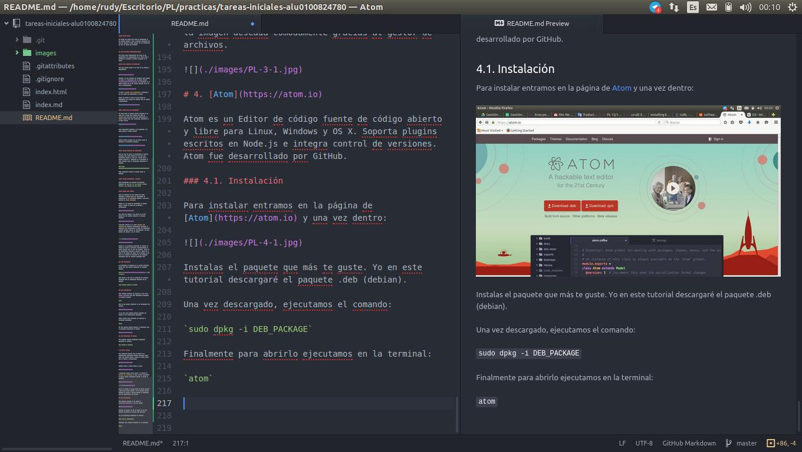

# 5. [Cloud 9](https://c9.io/)

__[Cloud 9](https://c9.io/)__ combina un editor de código potente junto con un entorno de trabajo Ubuntu en la nube, además de soportar más de 40 lenguajes.

### 5.1. Creación de cuenta

Primero entramos en [Cloud 9](https://c9.io/) y podemos ver que podemos registrarnos directamente desde GitHub:

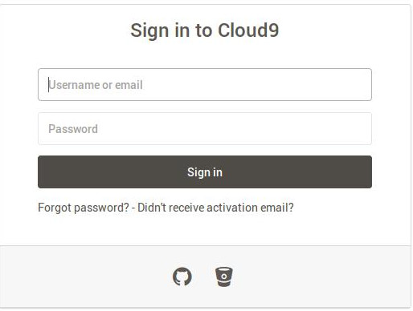

### 5.2. Vinculación

Para vincular nuestra cuenta de GitHub junto con c9. Simplemente a la hora de crear un entorno de trabajo (workspace) le podemos indicar que clone a partir de Git simplmente poniendo el URL del repositorio.

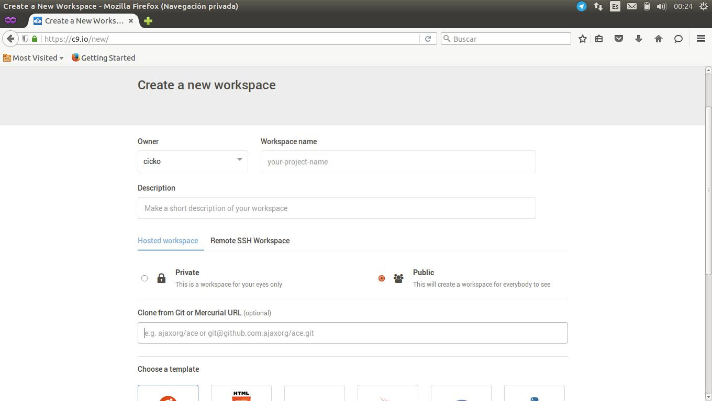

# 6. Markdown

Markdown es un lenguaje de marcado ligero, es decir que ocupa poco espacio y es fácil de editar, que trata conseguir la máxima legibilidad y facilidad de publicación tanto en sus formas de entrada como de salida.

Esta práctica se desarrolla en formato Markdown. Se emplea la siguiente sintaxis:

__Encabezados__
+ "# --> Para encabezados de tipo h1 equivalente en HTML"
+ "### --> Para encabezados de tipo h3 equivalente en HTML"
+ "###### --> Para encabezados de tipo h6 equivalente en HTML"

__Listas__
+ "+ fila1"
+ "+ fila2"
+ "+ fila3"

__Imágenes__

Para imágenes se pone "[título] (link_imagen)" sin el espacio entre medio.

__Enlaces__

Exactamente igual que las imágenes pero en vez de link_imagen es link_url.

# 7. [Pandoc](http://pandoc.org/)

Pandoc es una herramienta que nos permite exportar un fichero fuente en formato Markdown en otro fichero destino en formato HTML de modo que es muy cómodo para trabajar con páginas web.

Entramos primero en el siguiente [link](https://github.com/jgm/pandoc/releases/tag/1.16.0.2) para descargar el fichero .deb:

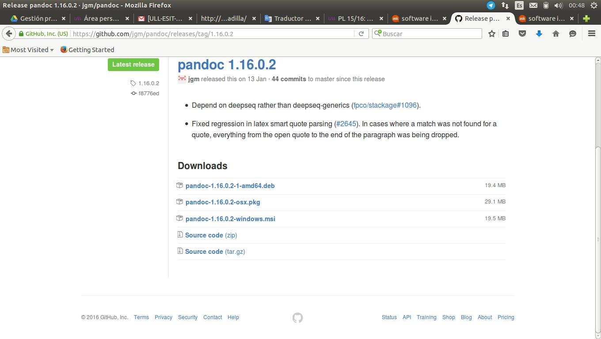

Que sería el fichero __pandoc-1.16.0.2-1-amd64.deb__

Una vez descargado ejecutamos el mismo comando que hemos ejecutado cuando instalamos __Atom__:

`sudo dpkg -i DEB_PACKAGE`
